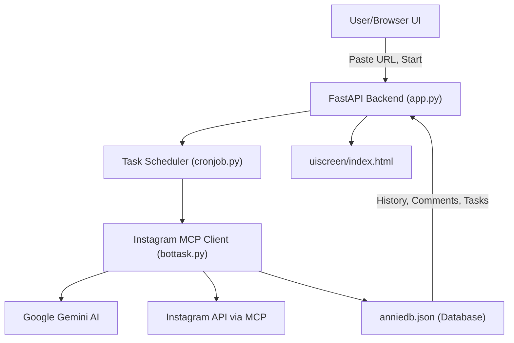

# Exa Helper


---

## 🚀 Project Overview

**Exa Helper** is an AI-powered Instagram automation tool that manages comments, DMs, and user engagement using advanced AI and a simple web UI. It stores task history and data in a lightweight JSON database.

---

## 🛠️ Installation

1. **Clone the repository:**
   ```bash
   git clone <repo-url>
   cd exa_helper
   ```
2. **Install requirements:**
   ```bash
   pip install -r requirements.txt
   ```

---

## 🔐 Configuration

1. **Set up your environment variables:**
   - Copy `env.example` to `.env`:
     ```bash
     cp env.example .env
     ```
   - Open `.env` and add your Instagram `USERNAME` and `PASSWORD`.

2. **(Optional) Set the DM URL:**
   - In your `.env`, add the key `DM_URL` with the link you want to DM to potential clients.

---

## 🏁 Running the App

1. **Start the backend server:**
   ```bash
   uvicorn app:app
   ```
   - Watch the terminal for logs and status updates.

2. **Open the UI:**
   - Open `uiscreen/index.html` in your browser.
   - Paste the link (DM URL) you want to send to potential clients.
   - Tap the **Play** button.
   - Keep an eye on the terminal (where `uvicorn app:app` is running) to ensure everything is working smoothly.

---

## 🗃️ Database

- `anniedb.json` is a lightweight JSON database used for storing data and task history completed by the AI.
- **Important:** Make sure to set the correct path to `anniedb.json` in `helper.py`. The AI uses this file to store and retrieve all relevant details and history. If you move or rename the file, update the path in `helper.py` accordingly.

---

## 🆘 Troubleshooting

- If you encounter any issues, glitches, or errors, please contact me directly:
  - [LinkedIn: Debdut Bhaduri](https://www.linkedin.com/in/debdut-bhaduri-32323156/)

---

## 🎬 Demo Video

<a href="https://www.linkedin.com/posts/debdut-bhaduri-32323156_ai-mcp-activity-7344696880439640065-O5yH?utm_source=social_share_send&utm_medium=member_desktop_web&rcm=ACoAAAvHs4sBZj1VzkgehFNRu1b6rNSunhZuTFk" target="_blank">
    
</a>

Or click here: [▶️ Watch the Demo Video on LinkedIn](https://www.linkedin.com/posts/debdut-bhaduri-32323156_ai-mcp-activity-7344696880439640065-O5yH?utm_source=social_share_send&utm_medium=member_desktop_web&rcm=ACoAAAvHs4sBZj1VzkgehFNRu1b6rNSunhZuTFk)

---

## 📚 Tags

`#python` `#fastapi` `#uvicorn` `#instagram-bot` `#ai` `#automation` `#webui` `#jsondb` `#gemini` `#asyncio`

---

## ✨ Enjoy using Exa Helper! ✨

---

## 🖥️ API Usage

You can control the AI task runner via HTTP endpoints:

### Start Monitoring a Post
```bash
curl --location 'http://localhost:8000/start_task' \
--header 'Content-Type: application/json' \
--data '{
  "time": 1,
  "post_url": "INSTAGRAM POST URL TO MONITOR"
}'
```
- `time`: Interval (in minutes) to check for new comments.
- `post_url`: The Instagram post URL to monitor.

### Stop Monitoring
```bash
curl --location --request POST 'http://localhost:8000/stop_task'
```

---

## 🏗️ Architecture & Flow

### System Flowchart



### How It Works

1. **User Interaction:**
   - The user opens the UI (`uiscreen/index.html`), pastes the Instagram post URL, and starts the task.
2. **Backend API:**
   - The FastAPI backend (`app.py`) receives the start/stop commands via HTTP endpoints.
3. **Task Scheduling:**
   - The scheduler (`cronjob.py`) manages periodic checks for new comments based on the interval set by the user.
4. **AI & Instagram Automation:**
   - The main logic (`bottask.py`) fetches comments, analyzes them with Google Gemini AI, and interacts with Instagram via the MCP client.
5. **Data Storage:**
   - All relevant data, including comments and task history, are stored in `anniedb.json` for persistence and tracking.

### Why This Architecture?
- **Separation of Concerns:** Each module (UI, backend, scheduler, AI logic, database) is independent, making the system modular and maintainable.
- **Scalability:** The backend and scheduler can be extended to handle more tasks or different social platforms.
- **Reliability:** Persistent storage ensures no data is lost between runs. The scheduler ensures tasks run at the correct intervals.
- **AI Integration:** Using Google Gemini AI allows for advanced comment analysis and response generation, making the bot more human-like and effective.
- **User-Friendly:** The UI and API endpoints make it easy for both technical and non-technical users to operate the system.

---

## 🔑 Important Setup Notes

- **Gemini API Key:**
  - You must add your own Gemini API key in `bottask.py` at the line:
    ```python
    GEMINI_API_KEY = "YOUR GEMINI API"
    ```
  - Get your API key from [Google AI Studio](https://aistudio.google.com/app/apikey) and replace the placeholder.

## 🖥️ Running the UI

To use the web interface:

1. Open a terminal and navigate to the project directory (if not already there).
2. Go to the UI folder:
   ```bash
   cd uiscreen
   ```
3. Open `index.html` in your web browser:
   - You can double-click the file in your file explorer, or
   - Run (on Windows):
     ```bash
     start index.html
     ```
   - Or (on macOS):
     ```bash
     open index.html
     ```
   - Or (on Linux):
     ```bash
     xdg-open index.html
     ```
4. Paste the Instagram post URL you want to monitor, then tap the **Play** button.
5. Watch the terminal running `uvicorn app:app` for logs and status updates.
